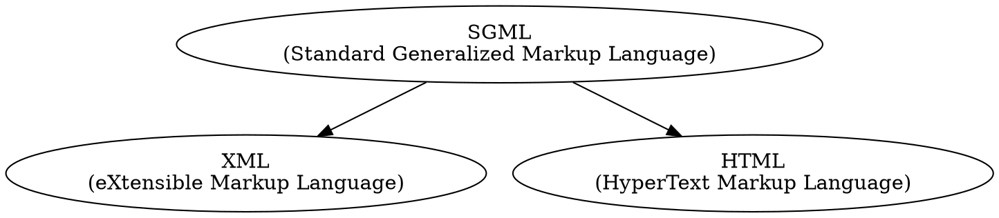

# XML for Dummies
## 4th edition (2005)
### by Lucinda Dykes and Ed Tittel

---
---

Learning to understand the power of XML.

---

[Chapter 01: Getting to Know XML](xmlDum_ch01) :- 

[Chapter 03: Slicing and Dicing Data Categories: The Art of Taxonomy](xmlDum_ch03) :- 

[Chapter 04: Adding XHTML for the Web](xmlDum_ch04) :- 
