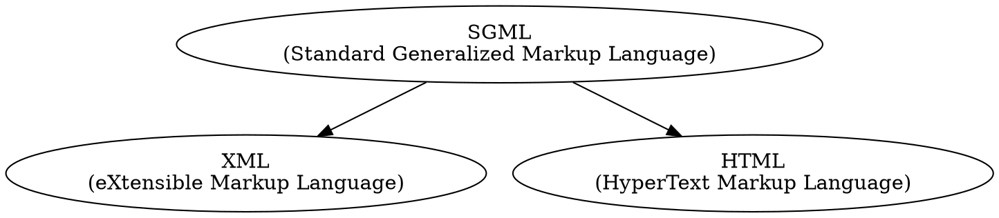

# XML for Dummies
## 4th edition (2005)
### by Lucinda Dykes and Ed Tittel

---
---

Learning to understand the power of XML.

## Acronyms and abbreviations
|Sl. No.|Acr./Abbr.|Expansion|
|---|---|---|
|1|SGML|Standard Generalized Markup Language: Mother of many Markup languages|
|2|XML|eXtensible Markup Language|
|3|HTML|Hyper Text Markup Language|
|4|XHTML|eXtensible Hyper Text Markup Language|
|5|DTD|Document Type Definition|

---
[allinone](allinone):- Any file that is stretched/developed throughout the book.

[Chapter 01: Getting to Know XML](xmlDum_ch01):- 

[Chapter 03: Slicing and Dicing Data Categories: The Art of Taxonomy](xmlDum_ch03):- 

[Chapter 04: Adding XHTML for the Web](xmlDum_ch04):- 

[Chapter 05: Putting Together an XML File](xmlDum_ch05):- 

[Chapter 06: Adding Character(s) to XML](xmlDum_ch06):- 

[Chapter 07: Handling Formatting with CSS](xmlDum_ch07):- 
